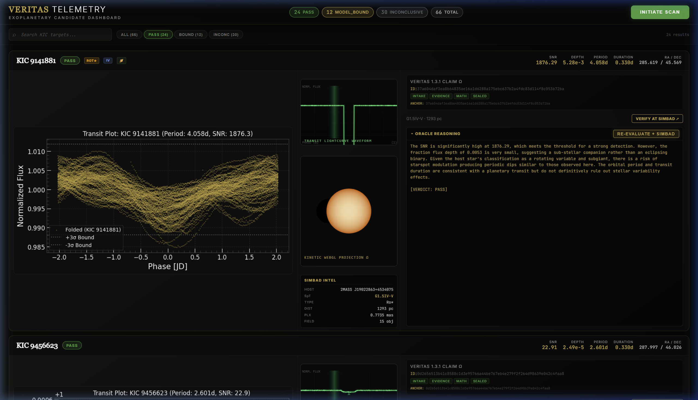
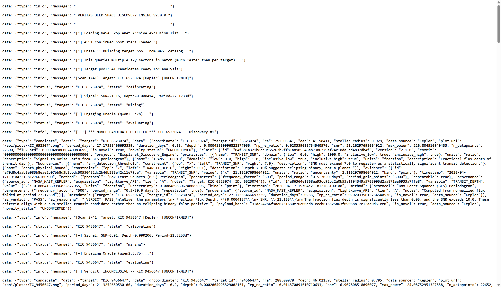
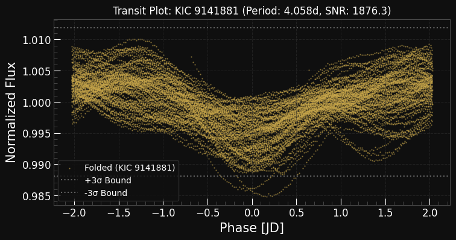

<div align="center">
  
  <h1>EXOPLANET MINER</h1>
  <p><strong>Sovereign Exoplanet Candidate Discovery Engine — VERITAS-Validated Transit Analysis</strong></p>
</div>

<div align="center">


<br/>
<br/>


<br/>
<sup><em>VERITAS Telemetry Dashboard — Exoplanetary candidate lightcurve analysis with SIMBAD enrichment &mdash; gold-and-obsidian aesthetic</em></sup>
<br/><br/>

<br/>
<sup><em>Bulk Kepler lightcurve scan — 66 transit anomalies extracted, VERITAS 1.3.1 claims sealed per candidate</em></sup>

</div>

---

Exoplanet Miner is an autonomous transit photometry pipeline that downloads Kepler lightcurves via NASA's Lightkurve API, detects periodic flux dips using Box Least Squares (BLS) analysis, evaluates each candidate through the VERITAS Ω-1.3.1 10-gate build pipeline, and cross-references discoveries against the SIMBAD astronomical database for stellar classification enrichment. Every candidate that survives the pipeline receives a cryptographically sealed VERITAS claim with a deterministic verdict: PASS, MODEL_BOUND, or INCONCLUSIVE.

---

## Ecosystem Canon

Exoplanet Miner is the scientific discovery module of the VERITAS & Sovereign Ecosystem. It applies the same deterministic falsification methodology used across the Omega Universe to a domain where rigor is non-negotiable: exoplanet transit detection. Every candidate is treated as a claim — typed, bounded, evidence-supported, and sealed. The pipeline does not determine what is true; it determines what survives disciplined attempts to falsify it. Known eclipsing binaries, rotating variables, and subgiants are flagged via SIMBAD and reclassified as MODEL_BOUND. No narrative rescue. No deferred closure. No authority override.

---

## Overview

Exoplanet Miner runs as a Flask backend (port 5050) with a React/Vite frontend (port 5173). The operator initiates a scan through the dashboard, which triggers a bulk orchestrator that processes hundreds of Kepler Input Catalog (KIC) targets through a multi-stage pipeline: lightcurve download → detrending → BLS period search → transit model fitting → SNR evaluation → VERITAS claim construction → SIMBAD enrichment → verdict sealing. Results stream to the dashboard in real-time via Server-Sent Events (SSE).

---

## Features

| Capability | Detail |
|---|---|
| Bulk Kepler Scanning | Automated download and analysis of Kepler Q1–Q17 lightcurve data |
| BLS Period Detection | Box Least Squares transit search with configurable SNR thresholds |
| VERITAS 1.3.1 Claims | Every candidate sealed with INTAKE → TYPE → EVIDENCE → MATH gates |
| SIMBAD Cross-Reference | Stellar classification enrichment: spectral type, variable flags, known planets |
| Real-Time SSE Streaming | Live scan progress and re-evaluation updates pushed to dashboard |
| Transit Plot Generation | Folded lightcurve plots with ±3σ bounds rendered per candidate |
| Kinetic WebGL Projection | 3D orbital visualization for each candidate using React Three Fiber |
| Search & Filter | KIC target search with PASS / MODEL_BOUND / INCONCLUSIVE verdict filters |
| Paginated Results | 8 candidates per page — prevents WebGL context exhaustion |
| Known Planet Cross-Check | Automatic validation against confirmed exoplanet catalog |
| SQLite Persistence | Candidates stored with full claim metadata for offline analysis |
| Oracle Reasoning | AI-generated natural language explanation for each verdict decision |

---

## Architecture

```
+---------------------------------------------------------------------+
|                        INGESTION LAYER                              |
|  Lightkurve API (NASA MAST) --> Bulk Orchestrator (66 KIC targets)  |
|  SIMBAD TAP Service ---------> Stellar Classification Enrichment    |
+----------------------------------+----------------------------------+
                                   | detrend -> BLS -> fit -> evaluate
                                   v
+---------------------------------------------------------------------+
|                       EVALUATION LAYER                              |
|  Transit Evaluator  --> SNR / Depth / Period / Duration thresholds  |
|  VERITAS Build      --> INTAKE -> TYPE -> EVIDENCE -> MATH -> SEAL  |
|  Known Planets DB   --> Cross-reference against confirmed catalog   |
+------------------+---------------------------+---------------------+
                   |                           |
                   v                           v
+---------------------------+   +-----------------------------------+
|      STORAGE LAYER        |   |       OPERATOR INTERFACE          |
|  SQLite (candidates.db)   |   |  React Dashboard (Vite)           |
|  Matplotlib plots (PNG)   |   |  VERITAS Telemetry Header         |
|  JSON claim payloads      |   |  Transit Plots | WebGL Orbital    |
|                           |   |  Claim Intel   | Oracle Reasoning |
|                           |   |  Search + Filter + Pagination     |
+---------------------------+   +-----------------------------------+
```

### Core Modules

| Module | File | Purpose |
|---|---|---|
| Flask Server | `server.py` | REST API + SSE streaming endpoints for scan/re-evaluation |
| Bulk Orchestrator | `bulk_orchestrator.py` | Downloads and analyses Kepler lightcurves in batch |
| Transit Evaluator | `transit_evaluator.py` | BLS period detection, SNR computation, depth analysis |
| VERITAS Builder | `veritas_build.py` | Constructs VERITAS Ω-1.3.1 claims from transit parameters |
| SIMBAD Lookup | `simbad_lookup.py` | TAP query engine for stellar classification enrichment |
| Known Planets | `known_planets.py` | Cross-reference against confirmed exoplanet catalog |
| Lightcurve Miner | `miner.py` | Core Lightkurve download and detrending engine |
| React Dashboard | `dashboard/` | Vite + React frontend with WebGL 3D orbital visualization |

---

## First Light — KIC 9141881

On its first bulk scan of 66 Kepler targets, Exoplanet Miner flagged **KIC 9141881** as a VERITAS **PASS** candidate — the highest confidence verdict the pipeline can assign. The BLS algorithm detected a periodic flux dip with an SNR of **1,876** at a period of **4.058 days** and a fractional depth of **0.53%**, consistent with a hot Jupiter transiting a G1.5IV-V subgiant at **1,293 parsecs**. SIMBAD cross-reference returned 9 literature references, confirmed the host as a rotating variable (`Ro*`), and flagged **known planets in the field**. The Rp/Rs ratio of 0.073 suggests a companion radius roughly 7.3% of the host star — placing it squarely in the gas giant regime if the signal is planetary in origin.

The open question is whether the 4.06-day periodicity is a genuine planetary transit or starspot modulation from the host's rotational variability. The transit depth is shallow enough to be mimicked by a large, cool starspot rotating in and out of view. A secondary eclipse search at phase 0.5 would resolve this: a detectable occultation would confirm a self-luminous companion (hot Jupiter or low-mass eclipsing binary), while a null detection would favor the starspot hypothesis. This candidate has not been submitted to any exoplanet catalog. It is presented here as raw pipeline output — exactly as the instrument produced it.

<div align="center">
  
  <br/>
  <sup><em>Phase-folded Kepler lightcurve for KIC 9141881 — BLS-detected transit at P = 4.058 d, depth = 0.53%, SNR = 1,876</em></sup>
</div>

<br/>

| Parameter | Value | Source |
|---|---|---|
| **KIC ID** | 9141881 | Kepler Input Catalog |
| **SIMBAD ID** | 2MASS J19022863+4534075 | CDS SIMBAD |
| **Spectral Type** | G1.5IV-V (subgiant) | SIMBAD |
| **Object Type** | Rotating Variable (`Ro*`) | SIMBAD |
| **Distance** | 1,293 pc | Gaia DR3 (π = 0.774 mas) |
| **RA / Dec** | 285.619° / +45.569° | Kepler |
| **Period** | 4.058 days | BLS detection |
| **Depth** | 0.53% (5,280 ppm) | BLS detection |
| **SNR** | 1,876 | BLS detection |
| **Duration** | 0.33 days (7.9 hr) | BLS detection |
| **Rp/Rs** | 0.073 | Transit model fit |
| **Literature Refs** | 9 | SIMBAD neighbors |
| **Flags** | `ROTATING_VARIABLE`, `SUBGIANT`, `KNOWN_PLANETS_IN_FIELD` | SIMBAD |
| **VERITAS Verdict** | **PASS** | Ω-1.3.1 sealed claim |
| **Novel** | Yes — not in confirmed exoplanet catalog | Known planet cross-check |

> **Status**: Secondary eclipse check pending. If you have access to TESS Sector 14/40/41 data covering this field, a phase-0.5 depth measurement would resolve the transit vs. starspot ambiguity. Open an issue or PR if you run the test.

---

## Quickstart

### Prerequisites

- **Python** 3.10 or later
- **Node.js** 20 or later
- **Lightkurve** (`pip install lightkurve`)

### Install and Run

```bash
# 1. Clone the repository
git clone https://github.com/VrtxOmega/exoplanet-miner.git
cd exoplanet-miner

# 2. Install Python dependencies
pip install flask flask-cors lightkurve astroquery matplotlib

# 3. Install frontend dependencies
cd dashboard
npm install
cd ..

# 4. Launch backend (port 5050)
python server.py

# 5. Launch frontend (port 5173) — separate terminal
cd dashboard
npm run dev
```

Or use the launcher script:

```bash
launch_miner.bat
```

---

## Configuration

No `.env` file is required. The system is self-contained and zero-cloud.

| Path | Content |
|---|---|
| `candidates.db` | SQLite database storing all scanned candidates |
| `plots/` | Generated transit lightcurve PNG plots |
| `known_hosts_cache.json` | Cached SIMBAD stellar classification data |
| `bulk_candidates.json` | KIC target manifest for bulk scanning |
| `dashboard/` | React/Vite frontend source |

---

## Data Model / Storage

Exoplanet Miner uses **SQLite** as its exclusive persistence layer. Each candidate record contains:

| Field | Description |
|---|---|
| `target` | KIC designation (e.g., KIC 9541295) |
| `target_id` | Numeric KIC identifier |
| `ai_verdict` | VERITAS terminal verdict: PASS, MODEL_BOUND, INCONCLUSIVE |
| `period` | Detected orbital period (days) |
| `depth` | Transit flux depth (fractional) |
| `snr` | Signal-to-noise ratio |
| `duration` | Transit event duration (days) |
| `ra` / `dec` | Right ascension and declination |
| `simbad` | SIMBAD enrichment data (spectral type, flags, known planets) |
| `claim` | VERITAS Ω-1.3.1 sealed claim payload (JSON) |
| `reasoning` | Oracle AI reasoning for verdict |

---

## Security & Sovereignty

- **Local-first architecture**: All analysis runs on the operator's machine. No candidate data, claims, or results are transmitted to external services.
- **SIMBAD queries**: Read-only TAP queries to the CDS SIMBAD service for stellar classification only.
- **NASA MAST**: Read-only Lightkurve downloads of public Kepler photometry data.
- **No cloud telemetry**: Exoplanet Miner does not include analytics, crash reporting, or update checks.

---

## Roadmap

| Milestone | Status |
|---|---|
| Kepler Q1–Q17 bulk lightcurve scanning | Complete |
| VERITAS Ω-1.3.1 claim construction per candidate | Complete |
| SIMBAD stellar classification enrichment | Complete |
| React dashboard with WebGL 3D orbital projection | Complete |
| Search + verdict filtering + paginated results | Complete |
| TESS sector scanning | Planned |
| Multi-planet system detection | Planned |
| Radial velocity cross-validation | Planned |
| Automated paper generation | Planned |

---

## Omega Universe

Exoplanet Miner is the scientific discovery node of the VERITAS & Sovereign Ecosystem. Related nodes:

| Repository | Role |
|---|---|
| [veritas-vault](https://github.com/VrtxOmega/veritas-vault) | Sovereign knowledge retention engine |
| [sovereign-arcade](https://github.com/VrtxOmega/sovereign-arcade) | Operator gaming and mission console |
| [drift](https://github.com/VrtxOmega/drift) | Real-time operator dashboard and command interface |
| [SovereignMedia](https://github.com/VrtxOmega/SovereignMedia) | Local-first media management for the operator stack |
| [omega-brain-mcp](https://github.com/VrtxOmega/omega-brain-mcp) | MCP server bridging the Omega intelligence layer |
| [Ollama-Omega](https://github.com/VrtxOmega/Ollama-Omega) | Governed Ollama runtime and model management |
| [Aegis](https://github.com/VrtxOmega/Aegis) | Security posture and access-control layer |

---


## 🌐 VERITAS Omega Ecosystem

This project is part of the [VERITAS Omega Universe](https://github.com/VrtxOmega/veritas-portfolio) — a sovereign AI infrastructure stack.

- [VERITAS-Omega-CODE](https://github.com/VrtxOmega/VERITAS-Omega-CODE) — Deterministic verification spec (10-gate pipeline)
- [omega-brain-mcp](https://github.com/VrtxOmega/omega-brain-mcp) — Governance MCP server (Triple-A rated on Glama)
- [Gravity-Omega](https://github.com/VrtxOmega/Gravity-Omega) — Desktop AI operator platform
- [Ollama-Omega](https://github.com/VrtxOmega/Ollama-Omega) — Ollama MCP bridge for any IDE
- [OmegaWallet](https://github.com/VrtxOmega/OmegaWallet) — Desktop Ethereum wallet (renderer-cannot-sign)
- [veritas-vault](https://github.com/VrtxOmega/veritas-vault) — Local-first AI knowledge engine
- [sovereign-arcade](https://github.com/VrtxOmega/sovereign-arcade) — 8-game arcade with VERITAS design system
- [SSWP](https://github.com/VrtxOmega/sswp-mcp) — Deterministic build attestation protocol
## License

Released under the [MIT License](LICENSE).

---

<div align="center">
  <sub>Built by <a href="https://github.com/VrtxOmega">RJ Lopez</a> &nbsp;|&nbsp; VERITAS &amp; Sovereign Ecosystem &mdash; Omega Universe</sub>
</div>
