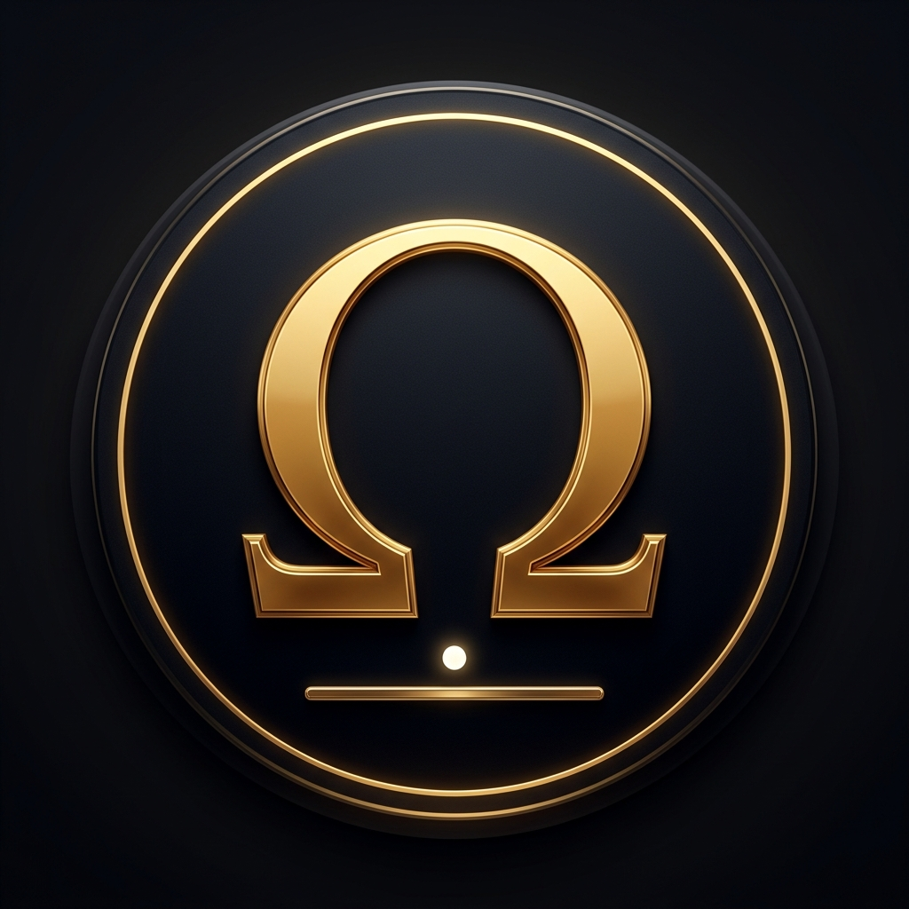

<div align="center">



# SOVEREIGN BREAKOUT
### VERITAS OMEGA — Data Lattice Assault

*Breach the encrypted data lattice using your Sovereign deflector.*

[](LICENSE)
[](https://vrtxomega.github.io/sovereign-breakout/)
[](https://github.com/VrtxOmega)

</div>

---

## ▶ Play Now

🌐 **[vrtxomega.github.io/sovereign-breakout](https://vrtxomega.github.io/sovereign-breakout/)**

Or open `index.html` locally in any modern browser.

---

## 🎮 Gameplay

A premium-grade arcade breakout game built with the **VERITAS gold-and-obsidian** design language. Shatter 12×8 encrypted data node lattices across 15 hand-crafted sector layouts.

| Control | Action |
|---|---|
| Mouse | Move deflector |
| Click | Launch / release magnet |
| `Space` | Aegis EMP (clears all nodes) |
| `Esc / P` | Pause |

---

## ⚡ Power-Ups

| Icon | Name | Effect |
|---|---|---|
| ⊕ | MULTI-PULSE | Split into 3 balls |
| ⟺ | WIDE ARRAY | +80px deflector width |
| ⏱ | TEMPORAL SLOW | Ball speed ×0.5 |
| 🛡 | AEGIS SHIELD | Safety net at bottom |
| ⚡ | LASER GRID | Auto-firing cannons |
| ◈ | PIERCE | Ball passes through blocks |
| 💥 | OVERLOAD | Bomb radius on hit |
| ⊛ | LOCK-ON | Magnet — catch and aim |

---

## 🏆 Trophy System

12 unlockable trophies tracked across sessions — from *First Node* to *Legend* (breach all 15 sectors).

---

## 💾 Upgrade Terminal

Between every sector, spend credits on:
- **Shield Plating** — wider deflector (max Lv 5)
- **Resonance Array** — +30% credit yield (max Lv 5)
- **Core Recovery** — extra life
- **Aegis EMP** — additional EMP charge

---

## 🖥 Desktop App (Electron)

```bash
cd sovereign-breakout
npm install
SovereignBreakout.bat     # Windows
# or: npx electron .
```

Launches with the Ghost Executive pattern —  appears as `SovereignBreakout.exe` in Task Manager with full PE metadata.

---

## 🏗 Architecture

| Layer | Tech |
|---|---|
| Game Engine | Vanilla HTML5 Canvas (zero deps) |
| Audio | Web Audio API (synthesized SFX) |
| Persistence | `localStorage` — career, leaderboard, upgrades |
| Desktop Shell | Electron 28 + Ghost Executive launcher |
| Design System | VERITAS Ω gold-and-obsidian |

---

<div align="center">

**VERITAS OMEGA** · VrtxOmega · MIT License

*What survives disciplined attempts to falsify it.*

</div>
